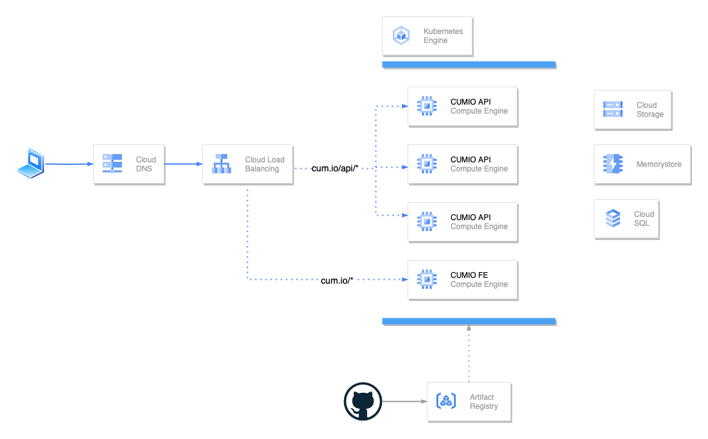

# Architecture

This directory contains all materials related to the design of the architecture.

For designing the infrastucture of the system the Google Cloud Platform was selected.

All of the solutions described bellow include a GCP Cloud DNS and Cloud Load Balancer.
Additionally, all the code is tested and build via GitHub Actions and the artifacts and sent to GCP Artifact Registry.

The DNS directs clients to the Load Balancer which is used as a proxy for the systems services.
Depending on the specific path, traffic, services usage and availibility, the client gets routed to
the most relevant service.

## Simple

This design should be sufficient for **1 000** active users.

Estimate: **USD 1,149.73** / month

[GCP Calculation link](https://cloud.google.com/products/calculator/#id=eafbad59-ee75-4f6f-8e0d-360d62df136c)

## Advanced

This design should be sufficient for **10 000** active users.

Estimate: **USD 8,024.03** / month

[GCP Calculation link](https://cloud.google.com/products/calculator/#id=3bff0407-2ef2-4a96-b0d0-c2000be1902f)

## Complex

This design should be sufficient for **1 000 000** active users.

Estimate: **USD 17,015.49** / month

[GCP Calculation link](https://cloud.google.com/products/calculator/#id=3a6eae04-2090-4947-9c0d-eb3726490050)

